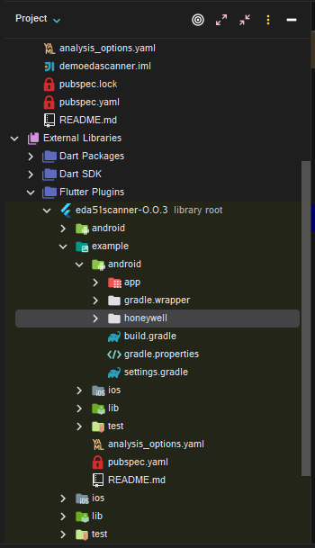
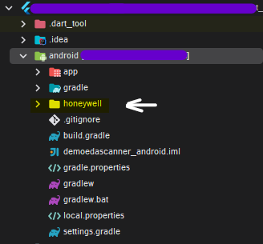

# eda51scanner

A new Flutter project.
## How to use
Step 1 : run the command 
```bash
flutter pub add honeywell_scanner
```
Step 2 : Copy the honeywell folder which is inside the example code sources at :
`.../.pub-cache/hosted/pub.dartlang.org/honeywell_scanner-x.x.x+x/example/android/honeywell`
or 

find the honey well folder in the external libraries tab if you dont find it there try restarting android studio.
*Paste The Copied Folder Into Your Android Module [as shown in the below figure]


Step 3: 
Add `include ':honeywell'` to `settings.gradle`

Step 4:
Add `tools:replace="android:label"` under the `application` tag in the **AndroidManifest.xml**.
If error remains, you should check if `xmlns:tools="http://schemas.android.com/tools"` is missing in the manifest block.

Step 5:
You are good to go..

0. Usage
```dart
Eda51scanner eda51scanner=Eda51scanner();
eda51scanner.startScanner()//starts the scanner instance
eda51scanner.startScanning()//makes the scanner scan the data

eda51scanner.onScannerDecodeCallback=(data){
//triggered on successful scan
};
eda51scanner.onScannerErrorCallback=(data){
//triggered on unsuccessful scan
};
```
## Getting Started

This project is a starting point for a Flutter
[plug-in package](https://flutter.dev/developing-packages/),
a specialized package that includes platform-specific implementation code for
Android and/or iOS.

For help getting started with Flutter development, view the
[online documentation](https://flutter.dev/docs), which offers tutorials,
samples, guidance on mobile development, and a full API reference.

